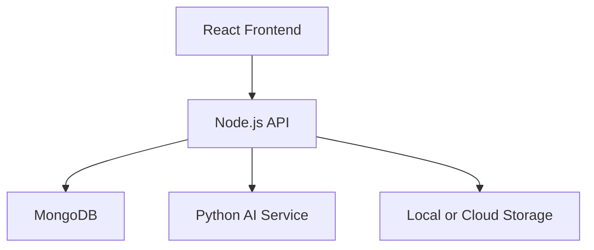

# DeepTrust MVP (React + Node + Mongo + AI Service)

This folder contains a working MVP roadmap implementation for:

- JWT authentication with risk-based redirect to FaceAuth
- Protected dashboard route
- Dashboard skeleton with cards, history, analytics (dummy trend)
- Media upload API with progress and DB status
- Python AI microservice scaffold for deepfake detection
- Docker compose architecture for scalable presentation

## Structure

- `backend/` Node.js + Express + MongoDB + Multer + JWT + bcrypt
- `frontend/` React + Router + Tailwind CDN classes
- `ai-service/` Flask microservice placeholder (`/analyze`)

## Phase 1 (implemented)

1. Authentication
   - `POST /api/auth/register`
   - `POST /api/auth/login` (risk-aware, redirects to `/face-auth` when risk >= 50)
   - `POST /api/auth/face-auth` (completes login)
2. Protected Dashboard
   - `GET /api/dashboard/overview` (JWT required)
3. Upload API
   - `POST /api/uploads` (JWT + Multer)
   - `GET /api/uploads` (JWT)

## Run locally

### Backend

1. `cd backend`
2. copy `.env.example` to `.env`
3. `npm install`
4. `npm run dev`

### Frontend

1. `cd frontend`
2. `npm install`
3. `npm run dev`

### AI Service

1. `cd ai-service`
2. `pip install -r requirements.txt`
3. `python app.py`

## Docker demo

From `deeptrust-mvp`:

- `docker compose up`

## Microservices diagram

## Competition pitch line

The AI detection service is containerized for scalable deployment and modular model upgrades.
